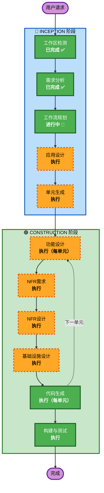

# 执行计划

## 详细分析摘要

### 变更影响评估
- **用户界面变更**: 是 — 全新的前端应用，包豪斯风格 UI
- **结构变更**: 是 — 全新的前后端架构
- **数据模型变更**: 是 — 全新的 PostgreSQL 数据库，12个数据模型
- **API 变更**: 是 — 全新的 REST API，9大模块约50+接口
- **NFR 影响**: 是 — 性能、安全、文件存储、部署架构

### 风险评估
- **风险等级**: 中等
- **回滚复杂度**: 低（绿地项目，无历史数据迁移）
- **测试复杂度**: 中等（多模块交互，文件上传，PDF生成）

## 工作流可视化



### 文本替代
```
INCEPTION 阶段:
  ✅ 工作区检测 (已完成)
  ✅ 需求分析 (已完成)
  🔄 工作流规划 (进行中)
  ⏳ 应用设计 (待执行)
  ⏳ 单元生成 (待执行)

CONSTRUCTION 阶段:
  ⏳ 功能设计 (待执行，每单元)
  ⏳ NFR需求 (待执行)
  ⏳ NFR设计 (待执行)
  ⏳ 基础设施设计 (待执行)
  ⏳ 代码生成 (待执行，每单元)
  ⏳ 构建与测试 (待执行)
```

## 阶段执行计划

### 🔵 INCEPTION 阶段
- [x] 工作区检测 (已完成) — 绿地项目，无现有代码
- [x] 需求分析 (已完成) — 8个功能模块，包豪斯UI，双环境部署
- [ ] ~~逆向工程~~ (跳过) — 绿地项目，无需逆向
- [ ] ~~用户故事~~ (跳过) — 需求文档已非常详尽，用户角色和权限清晰
- [x] 工作流规划 (进行中) — 本文档
- [ ] 应用设计 (执行)
  - **理由**: 新项目需要定义组件边界、服务层设计、模块间依赖关系
- [ ] 单元生成 (执行)
  - **理由**: 8个功能模块需要分解为可独立开发的工作单元

### 🟢 CONSTRUCTION 阶段（每单元循环）
- [ ] 功能设计 (执行，每单元)
  - **理由**: 每个模块有复杂的数据模型和业务逻辑需要详细设计
- [ ] NFR需求 (执行，首个单元时)
  - **理由**: 需要确定性能、安全、文件存储等非功能需求的技术方案
- [ ] NFR设计 (执行，首个单元时)
  - **理由**: 需要将NFR需求转化为具体的技术实现方案
- [ ] 基础设施设计 (执行，首个单元时)
  - **理由**: 需要设计 Docker Compose + Railway/Vercel 双环境部署架构
- [ ] 代码生成 (执行，每单元)
  - **理由**: 始终执行，生成实际代码
- [ ] 构建与测试 (执行)
  - **理由**: 始终执行，生成构建和测试指南

### 🟡 OPERATIONS 阶段
- [ ] 运维 (占位符) — 未来扩展

## 预估单元划分（初步）

基于开发文档的模块划分和用户指定的开发顺序：

| 单元 | 模块 | 说明 | 依赖 |
|------|------|------|------|
| Unit 1 | 项目基础 + 认证 | Django/React 项目骨架、Docker 配置、用户认证 | 无 |
| Unit 2 | 产品管理 | 产品CRUD、分类体系、图片上传、配置管理、Excel导入 | Unit 1 |
| Unit 3 | 产品图册 | 图册浏览、分类导航、搜索 | Unit 2 |
| Unit 4 | 客户案例 | 案例CRUD、行业分类、图片上传、关联产品 | Unit 2 |
| Unit 5 | 内部文档 | 文档管理、文件夹树、上传下载、在线预览 | Unit 1 |
| Unit 6 | 报价方案 | 报价单CRUD、明细管理、PDF导出 | Unit 2 |
| Unit 7 | 分享功能 | 分享链接、密码保护、访问记录 | Unit 2, 4, 6 |
| Unit 8 | 全局搜索 + 收尾 | 跨模块搜索、UI 微交互打磨、整体联调 | 全部 |

## 成功标准
- **主要目标**: 完成家具软装内部管理平台全部8个功能模块
- **关键交付物**: 可运行的前后端代码、Docker Compose 配置、Railway/Vercel 部署配置
- **质量门控**: 所有 API 接口可用、前端页面可访问、文件上传/下载正常、PDF 导出正常
